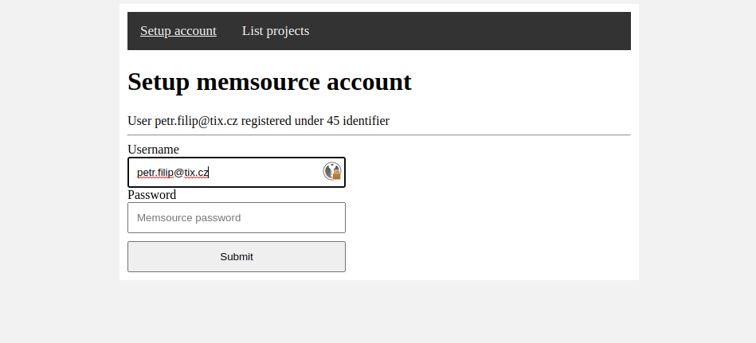
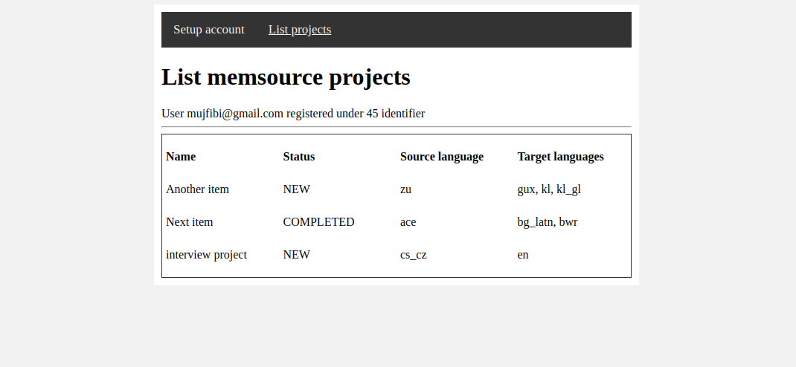

# Memsource interview assignment


## Demo

| Setup page                                           | List projects                  |
|------------------------------------------------------|-------------------------|
| [](demo-setup-account.png) | [](demo-list-projects.png) |


# How to run

Backend is standard Gradle Spring Boot application. Used Java version is 11.

```
gradle bootRun
```

Frontend is made in VueJs. It is placed in `frontend` directory.

```
cd frontend
npm install
npm run dev
```

# API

## POST /v1/memsource/users

Request body

```json
{
  "userName": "your@email.com",
  "password": "p@ssw0rd"
}
```

Response body

```json
{
  "id": 46,
  "userName": "your@email.com"
}
```

## POST /v1/memsource/projects

No response body

Request header

```json
X-userId: 46
```

Response body

```json
{
  "content": [
    {
      "name": "Another item",
      "status": "NEW",
      "sourceLang": "zu",
      "targetLangs": [
        "gux",
        "kl",
        "kl_gl",
        ...
      ]
    },
    ...
  ],
  "totalElements": 3,
  "totalPages": 1,
  "pageNumber": 0,
  "numberOfElements": 3
}
```

### Development information

- backend without tests: 2.5 hours
- frontend without tests: 3 hours (first time with VueJs)

# Assignment

- Create Spring Boot application.
- The application will have 2 pages.

### Setup Page
- Memsource account can be configured here.
- The configuration should be represented as a Spring entity class.
- Two text fields for username and password.
- Configuration can be edited and must be saved on a persistent storage (H2 database, for example).
- No need to care about the security of a password.

### Projects Page
- List projects retrieved from https://cloud.memsource.com/web/docs/api#operation/listProjects
- You will need https://cloud.memsource.com/web/docs/api#operation/login to login first
- Name, status, source language and target languages should be displayed
- You should load and render the projects in JavaScript
- You will need to implement an endpoint in your application that will provide the data for an AJAX call


### Requirements
- Create production quality code.
- Understand AJAX.